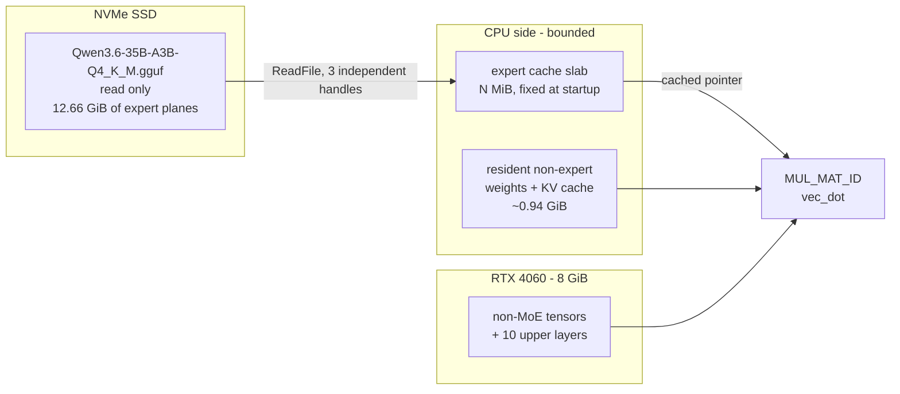
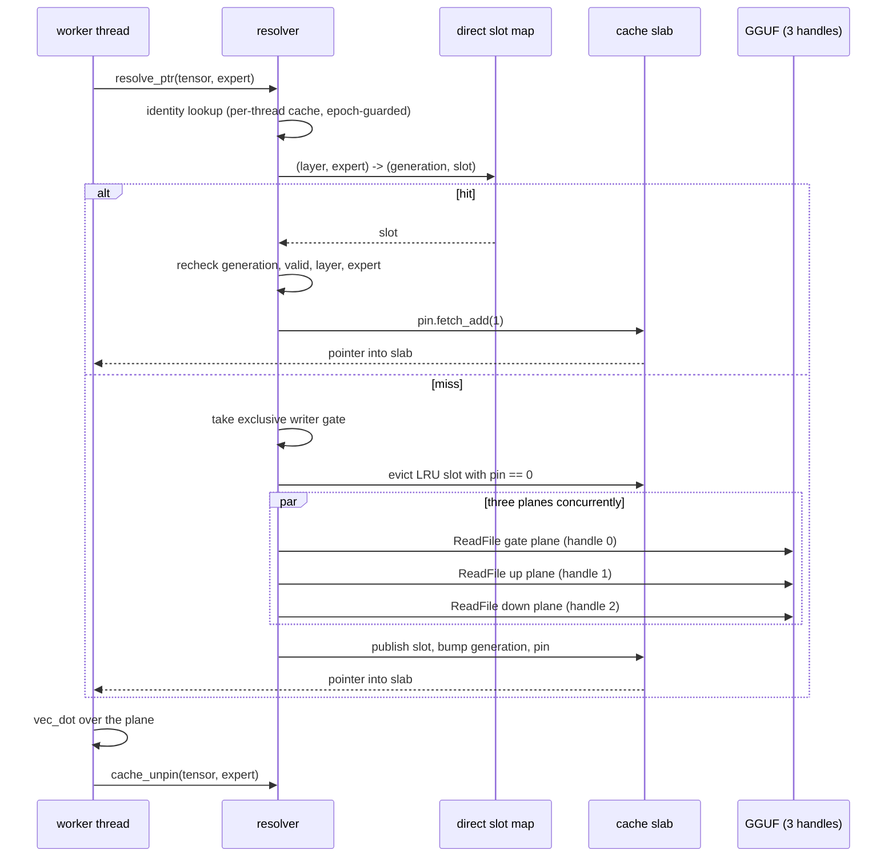

# Architecture

How a 35B mixture-of-experts model runs in 3.4 GiB of working set on a machine that
cannot hold it, while producing output bit-identical to the unmodified runtime.

---

## 1. The problem

`Qwen3.6-35B-A3B` in `Q4_K_M` is a 19 GiB GGUF. The target machine has 32 GiB of RAM
and an 8 GiB RTX 4060.

Model geometry, read from the GGUF metadata:

| property | value |
|---|---|
| architecture | `qwen35moe` |
| blocks (layers) | 40 |
| embedding length | 2048 |
| experts per layer | **256** |
| experts activated per token | **8** |
| expert FFN length | 512 |
| quantization | Q4_K_M |

With `-ngl 999 -ncmoe 30`, the 10 highest layers and every non-MoE tensor go to the
GPU, and the MoE expert weights of the first 30 layers stay on the CPU side. Those are
what will not fit:

- each expert tensor (`ffn_gate_exps`, `ffn_up_exps`, `ffn_down_exps`) is
  `2048 x 512 x 256` in Q4_K = **150,994,944 bytes exactly (144 MiB)**
- 30 layers x 3 kinds = **90 tensors = 12.66 GiB**

That 12.66 GiB is the entire problem. It is also almost entirely idle: only **8 of 256
experts per layer** are touched for any given token.

### Why the obvious answers do not work

**Memory-map the file and let the OS decide.** This is what unmodified llama.cpp does,
and it works — at 13.7 GiB of working set. The OS is a good pager, but its residency
decision is invisible and unbounded. You cannot ask for "run in 3.4 GiB"; you get
whatever the page cache decides, and it competes with everything else on the machine.
This is the reference path, not a target.

**Load only the active experts.** Routing is per token and per layer. There is no
prefix of the model that is "the active part".

**Quantize further.** Changes the model. Out of scope: every EXACT profile in this
project produces the identical token stream.

---

## 2. The idea: experts as an external, bounded, demand-paged store

Expert weights are never written during inference and are addressed by a
`(layer, kind, expert_id)` triple with a fixed stride. That makes them an ideal
candidate for an explicit cache with a **hard capacity bound**, backed by the GGUF file
itself.



The contract:

- **Working set is chosen, not discovered.** `peak WS = 0.938 GiB + cache size`,
  measured constant from a 256 MiB cache upward. The user picks the memory budget.
- **Output is unchanged.** The compute reads the same bytes it would have read from a
  mapped file; only their provenance differs.

---

## 3. Components

### 3.1 The registry — `llama-model-loader.cpp`

During tensor loading, every CPU-override MoE expert tensor is registered instead of
allocated:

```c
struct ggml_expert_storage_info {
    const struct ggml_tensor * tensor;
    const char * name;
    int      layer;
    int      kind;          // 0 = gate, 1 = up, 2 = down
    uint32_t file_index;
    uint64_t os_handle;     // the GGUF file handle
    uint64_t absolute_offset;
    uint64_t plane_stride;  // bytes between consecutive experts
    uint64_t plane_size;    // 589,824 bytes for this model
    uint64_t tensor_size;
    int      ggml_type;
    uint32_t n_experts;     // 256
    int      cpu_override;
};
```

`plane_size = 150,994,944 / 256 = 589,824 bytes`. One expert's contribution to one
tensor is called a **plane**; the three planes of one expert in one layer are a
**bundle**, `3 x 589,824 = 1,769,472 bytes`.

`B1B_EXTERNAL_MAX_LAYERS=N` caps registration to layers below `N`. Layers at or above
the cap take the ordinary loader path: they cost resident memory and pay no copy. That
single knob is what opens the entire memory/throughput curve — `MAX_SPEED_EXACT` is
just `N=2`.

### 3.2 The external buffer — `llama-model.cpp`, `ggml-backend.cpp`

A registered tensor is bound to a buffer that **reserves address space without
committing memory**. `ggml_backend_cpu_external_expert_buffer()` returns a buffer whose
base pointer is valid to compare against but whose pages are never touched.

This is where the project's most instructive bug lived. See section 6.

### 3.3 The resolver — `ggml-expert-indirection.cpp`

`ggml_expert_resolve_ptr(src0, expert_id, expert_stride)` is the whole interface the
compute path sees. It returns a pointer to a materialised expert plane inside the cache
slab, with the containing slot **pinned**.



**LRU with pinning.** A slot may only be evicted when `pin == 0`. The pin is the
lifetime guard, and it is the reason a resolved pointer is safe to hold across the
whole `vec_dot`: while pinned, the slot's contents, `layer`, `expert` and `valid` flag
cannot change.

**The direct slot map** is a fixed array of `atomic<uint64_t>` packing
`(generation, slot + 1)`, keyed by a hash of `(layer, expert)`. The generation makes a
stale entry detectable rather than dangerous.

### 3.4 Consumption — `ggml-cpu.c`

In `ggml_compute_forward_mul_mat_id`, the expert loop is executed by **every** worker,
not partitioned across them. Each worker independently resolves, pins, computes its row
range, and unpins. For an active expert, `n_threads` resolves and `n_threads` unpins
happen. At `-t 4` and 512 tokens that is roughly 1.5 million resolver calls.

Row bounds are validated against the plane extent before every use, so a corrupt or
stale pointer becomes a counted failure rather than a wild read.

### 3.5 Windows I/O: independent file handles

The single most valuable measurement in the project.

`c7_read_scaling.exe`, 589,824-byte reads at expert-strided offsets, warm:

| threads | one shared handle | independent handles |
|---:|---:|---:|
| 1 | 7.10 GB/s | 6.77 GB/s |
| 2 | 6.60 | 10.29 |
| 3 | 6.63 | 12.74 |
| 4 | 6.60 | 14.50 |
| 6 | 6.21 | 16.27 |
| 8 | 6.40 | **16.70** |
| 12 | 6.23 | 16.24 |

**Reads that share a Windows file object are serialised by the kernel and do not scale
at all.** The original design duplicated one handle, which cannot overlap by
construction. Opening three genuinely independent handles — one per plane kind — and
issuing the three plane reads of a bundle concurrently was worth **+16.6 %**.

Widening from 3 readers to 6 gained nothing measurable: a 1.77 MB bundle is already
past the useful part of that curve.

---

## 4. The two compute paths

### EXACT

The plain `vec_dot` Q4_K path, reading expert planes from the cache slab. Byte-for-byte
the same input as the mapped path, so the **greedy token stream** is bit-identical:
`414B86C6E75D7126...`.

That is a claim about the token stream, not about the logits. Phase G measured
perplexity — which reads logits directly rather than only their argmax — across EXACT
configurations that differ only in cache size or external-layer count, and found small,
non-zero differences between them (see `CORRECTNESS.md` §1). Why byte-identical input
produces logits that differ in low bits was not traced; it is an open question, not a
resolved one. It does not affect the token-stream guarantee, which is checked directly on
every run rather than inferred from the input being identical.

### REPACK

llama.cpp ships a "repack" CPU buffer type that stores Q4_K weights in a packed layout
and runs them through blocked GEMM/GEMV kernels (`q4_K_8x8_q8_K` on AVX2) instead of
per-row `vec_dot`. This build already had `GGML_CPU_REPACK=ON`, but `-ncmoe` forced the
override buffer type to plain CPU, bypassing extra-buffer-type selection entirely.

Letting `-ncmoe` select the repack buffer type when `B1B_MOE_REPACK=1` is a three-line
change and is worth **+30 %** on the resident path.

It is a different configuration, not a faster version of the same one. The packed
kernels accumulate in a different order, so under greedy decoding the token stream
eventually diverges: hash `1D63259E5842DFE3...`. It is deterministic and
thread-independent. See `QUALITY_REPORT.md`.

**Repack does not help the external path.** Measured with a 12288 MiB cache, where the
per-admission repack cost is largely amortised away, it was worth only **+4.7 %**
against the +30 % it gives resident weights. The Q4_K arithmetic is not where the
external path spends its time. That is why `LOW_MEMORY_REPACK` does not exist.

---

## 5. Thread count

The largest single lever found, and it is not in the cache at all.

512 tokens, `B1B_EXTERNAL_MAX_LAYERS=1`, cache 1024 MiB, identical hash at every point:

| threads | 3 | **4** | 5 | 6 | 7 | 8 | 10 | 12 | 14 | 16 |
|---|---:|---:|---:|---:|---:|---:|---:|---:|---:|---:|
| TG | 31.36 | **32.19** | 31.68 | 30.11 | 26.74 | 25.29 | 22.13 | 19.77 | 16.96 | 14.81 |

`-t 4` is **2.17x** `-t 12`.

The i5-14400F is a hybrid part: 6 P-cores with SMT plus 4 E-cores, 16 logical threads.
ggml synchronises workers with `ggml_barrier` at every graph node, so the slowest
worker sets the pace. At `-t 12` Windows spreads workers over hyperthread siblings and
E-cores; siblings contend for the same execution units and L1/L2 on a memory-heavy Q4_K
matmul, and E-cores are simply slower. Every barrier then waits on the stragglers.

The entire project had been benchmarking at `-t 12`, close to the worst setting for
this CPU. Every absolute number recorded before this discovery was limited by thread
scheduling rather than by the expert cache. The relative comparisons survived because
both arms always used the same thread count.

CPU affinity masks (`-C`, `--cpu-strict`) made things **worse** in every configuration
tested. The Windows scheduler places these threads better than llama.cpp's affinity
path does.

The repack path is different: it scales to `-t 12`, which is why `MAX_SPEED_REPACK`
uses 12 threads and every EXACT profile uses 4. The plain path's thread ceiling is a
property of the `vec_dot` kernel, not of the cache — the unmodified resident path
shares it.

---

## 6. The D1 correctness fix

Real-use validation uncovered a blocking defect that 512-token benchmarking had never
seen: **any batch of 32 or more tokens crashed the external path with an access
violation.** Every benchmark until then had used a five-token prompt.

Cause: the external buffer advertised itself as **host memory**. The CUDA scheduler saw
host-resident weights, decided it could offload the operation, and copied expert
weights out of reserved-but-uncommitted address space. The pages were never there.

The pre-external baseline crashed identically, and the mapped path was unaffected, so
this was a latent property of the buffer's advertised type rather than something the
cache introduced.

`--no-op-offload` avoided it completely and cost nothing at decode, but that is a
workaround. **D1** changed the external buffer to a non-host buffer type, which stops
the scheduler from ever attempting the copy. It fixed the crash and was
performance-neutral.

The lesson is about the benchmark, not the buffer: a five-token prompt exercised none
of the batching paths a real server uses. The G5 real-use validation exists because of
this.

---

## 7. Where the time goes

At `LOW_MEMORY_EXACT` (`-t 4`, cache 2560 MiB), 512 tokens, 20.785 tok/s:

| item | seconds / 512 tokens | share |
|---|---:|---:|
| generation wall | 24.63 | 100 % |
| bundle copy (ReadFile, 3 readers overlapped) | ~5.84 | 23.7 % |
| row validation (after F5) | ~0.05 | 0.2 % |
| resolver, pin, unpin | small | - |
| compute and everything else | ~18.7 | 76 % |

Per token the run moves **405 MiB** of expert bundles (240 bundles of 1.77 MB: 30
layers x 8 active experts). At a 2560 MiB cache that is **57.8 GB written into the slab
per 512-token run**, and the same amount read out of the page cache.

### The ceiling

If the copy and its side effects were free, this point would run at **26.7 tok/s**.
Measured: 20.785, which is **78 %** of that bound.

The remaining cost is not overhead that a micro-optimisation removes. It is the copy
itself, in two forms: its direct `ReadFile` time, and the memory bandwidth its traffic
consumes in competition with the Q4_K dot products. Both are properties of *being* a
cache that materialises copies.

**Closing the rest means not copying, which means mapping, which means giving the
residency decision back to the OS and losing the bounded footprint. The two goals are
in direct opposition.** That is the honest end of this line of work.

### Why the load cannot be hidden

Three independent attempts failed for the same reason:

- **B2e** speculative cross-layer async prefetch: −3.02 %
- **C4** unlocked concurrent cache-miss loads: +3.0 % alone, but a real race once loads
  actually overlapped
- **C5** staggered per-worker expert order: exactly neutral at 512 tokens

During decode, **all workers need the same expert bundle before any of them can
compute with it**, and there is no independent work left to overlap against. The load
is on the critical path by construction. What worked instead was making the unavoidable
load faster — the three concurrent plane reads of section 3.5.

### Why the cache cannot simply be made bigger

| cache | 128-token TG | misses | bytes read | read latency | min available RAM |
|---:|---:|---:|---:|---:|---:|
| 1024 MiB | 8.813 | - | - | - | 15.49 GiB |
| **2048 MiB** | **10.409** | 12,012 | 21.3 GB | 4.13 s | 14.30 GiB |
| 4096 MiB | 10.244 | 6,023 | 10.7 GB | 5.21 s | 12.48 GiB |

*(measured at `-t 12`, before the thread-count discovery; the shape is what matters)*

At 4 GiB the miss count halves but per-read latency rises 2.5x. **The slab and the
Windows page cache compete for the same RAM**, and the slab is the worse of the two
caches because it also pays the copy. The optimum is where they balance.

---

## 8. Memory model

```
peak working set  =  0.938 GiB  +  cache size
```

Measured constant from a 256 MiB cache upward. The fixed term covers resident non-expert
weights, the KV cache at a 16384 context, and runtime overhead.

This is the entire user-facing story of the low-memory curve: **choose the cache size,
get the working set.**

A consequence worth stating plainly: a 3.5 GiB budget caps the cache at about 2.56 GiB,
and the measured curve puts 22 tok/s at a 3072 MiB cache (3.94 GiB). Tiers beyond
"20 tok/s in 3.5 GiB" are not reachable by cache sizing alone.

---

## 9. A note on the diagnostic counters

`external_logical_bytes` and `external_reserved_bytes` report `27,179,089,920`, which is
exactly **twice** the physical 12.66 GiB of expert weights. The loader materialises two
ggml contexts holding duplicate tensor objects, and the accounting hook runs for both.

The physically verified figures are: **90 expert tensors**, 144 MiB each, **12.66 GiB**
total, **240 bundles (405 MiB) touched per token**. The last of these is independently
confirmed by `full_bundle_bytes_per_token = 424,673,280 = 240 x 1,769,472`.

The safety counters — pins, unpins, failures, bounds checks — are per-event and are not
affected.

---

## 10. What is deliberately not here

- **No GGUF modification.** The file is opened read-only and is never written. There is
  no repacked sidecar, no index, no derived artifact.
- **No tiering or migration policy.** Offline analysis over 1,198,800 routed selections
  found no policy meeting coverage >= 80 %, migration <= 150 MB/token and thrash <= 10 %
  simultaneously. Expert locality is only moderate.
- **No speculative prefetch.** See section 7.
- **No lock-free unpin.** Two independent implementations were correct and both lost
  throughput. "The cache locks are the bottleneck" is disproven.

`RESEARCH_HISTORY.md` records these with their measurements.
