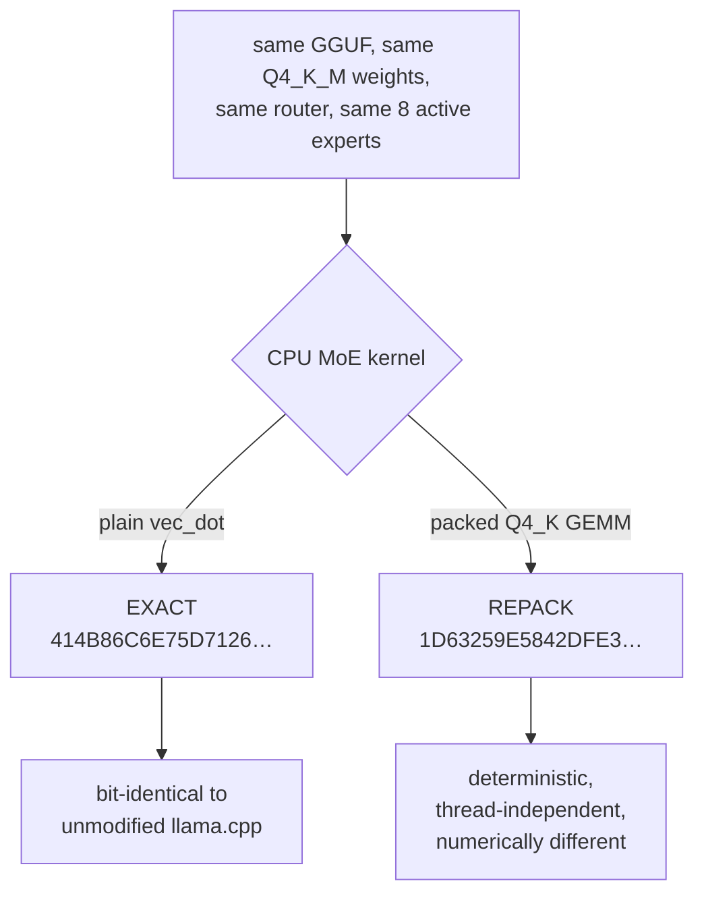

# Quality report — EXACT versus REPACK

Everything measured about whether `MAX_SPEED_REPACK` gives up quality for its speed,
and — just as importantly — what that evidence does not cover.

---

## 1. The question

Five of the six profiles produce a token stream **bit-identical** to unmodified
llama.cpp. For those, quality is not a question: identical bytes in, identical bytes out.

`MAX_SPEED_REPACK` is the exception. It routes CPU MoE weights through llama.cpp's packed
Q4_K GEMM kernels (`q4_K_8x8_q8_K` on AVX2) instead of the per-row `vec_dot` path. These
accumulate in a different order, so results differ in the last bits and, under greedy
decoding, the token stream eventually diverges.

It is worth **+27 %** over `MAX_SPEED_EXACT` — 40.974 against 32.268 tok/s. The question
is what it costs.



Nothing about the model changes: same weights, same quantization, same routing, same
active expert count. This is the same class of change as choosing a different SIMD
kernel, and it is upstream llama.cpp functionality rather than a project invention.

---

## 2. What is established without argument

**Deterministic.** Repeating the configuration reproduces `1D63259E5842DFE3` exactly.
Confirmed again during Phase G: three clean-room runs at 512 tokens, identical hash every
time.

**Thread-independent.** `repack, external limit=2` produced `87C19214B464CCAD` at both
`-t 4` and `-t 6`. Output does not depend on how many workers ran.

Determinism matters more than it might seem. A configuration that produced different text
run to run would be unusable regardless of its average quality; this one does not.

---

## 3. Perplexity

### The matched comparison

The only clean way to ask "what does repack cost" is to change **one** thing. These pairs
are identical in every respect except the repack flag: same corpus, same 24 chunks, same
`-c 512 -b 512 -ub 512 -ngl 999 -ncmoe 30 -t 12 -fa on`, resident weights in both arms.

| corpus | plain `vec_dot` | packed Q4_K | delta | stderr |
|---|---:|---:|---:|---:|
| C/C++ code, 400 KB | 1.8123 | **1.8113** | **−0.055 %** | ±0.0357 |
| English prose, 356 KB | 5.9473 | 5.9626 | +0.257 % | ±0.2021 |
| English prose, 104 KB (distinct text) | 2.7342 | 2.7352 | +0.037 % | ±0.0731 |
| Thai prose, 22 KB | 5.7578 | **5.7568** | **−0.017 %** | ±0.4660 |

Two observations do the work.

**Every difference is far inside its own standard error.** The largest, +0.257 %, sits
against a standard error of about 3.4 %. Perplexity cannot resolve a difference this
small on these corpora.

**The sign changes between corpora.** Repack is nominally *better* on code and Thai,
nominally *worse* on English. Systematic degradation does not alternate sign; noise does.

### A correction to the earlier evidence

The original quality work described "four corpora". Phase G found that two of them are
**not independent**: `english-356k.txt` is a byte-exact prefix of `english-460k.txt`, so
at any chunk count that fits inside the shorter file, the two runs read the same text.
That is why both reported identical perplexity to five significant figures in the first
Phase G pass.

The corrected description: **four perplexity runs over three distinct sources** — English
documentation, C/C++ source, and Thai prose. A fourth genuinely distinct English sample
(`english-tail`, the 104 KB that follows the shared prefix) was created for Phase G and
appears in the table above, so the matched comparison now covers four non-overlapping
texts.

The approved public claim names three kinds of text and was never wrong. The word "four"
attached to "corpora" was.

### Reproducibility of the measurement itself

Where the configuration matched the original research exactly, the Phase G re-run
reproduced it **to the last digit**: `english-356k` plain `-t 12` = 5.9473, repack = 5.9626,
Thai repack = 5.7568. Those are the same values recorded months earlier, from an
independently rebuilt binary.

Absolute values are only comparable at the same chunk count. Phase G used a uniform 24
chunks; the original used 40/40/24/7, so its 460 KB and code figures are not directly
comparable to the table above. Only the A/B within a run is.

---

## 4. Task-level comparison

Perplexity measures next-token prediction on held-out text. It says nothing about whether
a model can still do arithmetic, follow a formatting instruction, or find a string in a
long document. Phase G added a task battery to cover that gap.

**Method.** Both arms run the identical 15-task set through `llama-server` with identical
prompts, `--seed 42`, `temperature 0`, and prompt caching disabled. Each task is then
classified:

| verdict | meaning |
|---|---|
| `BIT_IDENTICAL` | the two arms produced exactly the same text |
| `TASK_EQUIVALENT` | text differs, but every objective check agrees between arms |
| `DIVERGENT_UNSCORED` | text differs and the task has no objective check |
| `DIFFERENT` | at least one objective check **disagreed** between arms |

The checks are mechanical predicates, not judgements about prose: a known numeric answer,
a required word, a stated formatting constraint, a verification code planted in a long
document, Thai-script coverage. 27 checks across the battery.

Tasks cover chat, multi-turn follow-up, arithmetic reasoning, logical reasoning, code
generation, code explanation, instruction following, factual recall, long-form writing,
Thai chat, Thai long-form, Thai reasoning, and two long prompts that force prompt batches
of a few thousand tokens.

### Results

| verdict | tasks |
|---|---:|
| `BIT_IDENTICAL` | **5** |
| `TASK_EQUIVALENT` | 9 |
| `DIVERGENT_UNSCORED` | 0 |
| `DIFFERENT` | **1** |
| `INCOMPLETE` | 0 |

**27 objective checks: 26 agreed, 1 disagreed.** The EXACT arm passed 24, the REPACK arm 23.

**Five tasks came out character-for-character identical** between the two kernels:
`chat-short`, `instruction-single`, `instruction-format`, `factual-recall` and
`needle-retrieval`. This is stronger evidence than any perplexity number. Where the answer
is short and determinate — one word, three bullets, four facts, a verification code
retrieved from a 1,234-token document — the two kernels produce the same text exactly. The
divergence only appears once an answer runs long enough for a last-bit difference to
accumulate into a different token choice.

**The single disagreement** was on `code-explanation`, check *"identifies the pin check as
guarding against eviction or reuse"*: the EXACT arm satisfied it, the REPACK arm did not.

That task hit its 1,200-token budget **in both arms**, so both answers were cut off
mid-explanation. A check that looks for a specific statement can flip purely on where the
cut fell. It is recorded as a disagreement because it is one, but it is the weakest kind
of evidence in this report, and it is one check out of 27 with nothing similar beside it.

**Raw data:** `tests/results/quality-exact-vs-repack/quality_results.json`,
`quality_results.csv`, `quality_checks.csv`, and `transcripts-side-by-side.txt` for
reading what actually differed.

**How to read a `DIFFERENT` verdict.** It means one arm satisfied an objective check the
other did not, on that prompt, at temperature 0. On a single sample it is evidence of a
divergence, not proof of systematic weakness — greedy decoding amplifies a last-bit
difference into a different word, and a different word can flip a formatting check. What
would be damning is a *pattern*: one arm losing repeatedly across related checks. A
scattered handful in both directions is the same noise signature the perplexity numbers
show.

Where checks disagreed, the direction and the task are recorded in `quality_checks.csv`.
Nothing is aggregated away.

---

## 5. The supported claim

> **No measurable quality degradation was observed on the tested English prose, C/C++
> code, and Thai perplexity corpora.**

That sentence is the whole claim, and it is bounded by the word *tested*.

### What is explicitly not claimed

- that quality is identical in general
- anything about reasoning accuracy beyond the arithmetic and logic tasks in the battery
- anything about instruction following beyond the format constraints tested
- anything about factual recall beyond four short questions
- anything about long-context behaviour beyond a few-thousand-token prompt
- anything about languages other than English and Thai
- any task-level benchmark result (MMLU, HumanEval, or similar) — none was run

**REPACK is never called "lossless."** It is a numerically different configuration whose
token stream diverges from the reference, is deterministic and thread-independent, and
shows no measurable degradation in the tests that were actually run.

---

## 6. Why the evidence stops here

The obvious next step is a standard task benchmark. It was not run, for a reason worth
stating rather than hiding: a meaningful MMLU or HumanEval pass requires downloading a
large evaluation set and several hours of generation **per arm** on this hardware, and
the brief for this phase was explicitly not to download large datasets unnecessarily.

The honest position is that the evidence supports a bounded claim, and the bound is
stated. Someone who needs a stronger guarantee than that should use an EXACT profile,
which needs no quality argument at all — it is bit-identical to the runtime they would
otherwise have used.

---

## 7. Practical guidance

**Use an EXACT profile if:**

- you are comparing against unmodified llama.cpp and need the outputs to match
- you are reproducing published results
- you need a guarantee rather than an absence of measured harm
- you want the low-memory profiles at all — REPACK has no low-memory variant

**Use `MAX_SPEED_REPACK` if:**

- you have roughly 14 GiB of RAM to spare, and
- throughput matters more to you than bit-identical reproduction, and
- you have read this page

There is no `LOW_MEMORY_REPACK`. It was implemented and measured: packed kernels are
worth only **+4.7 %** on the external path against the +30 % they give resident weights,
which does not justify leaving the EXACT class. See `RESEARCH_HISTORY.md`, entry F3.

---

## 8. Reproducing this

```powershell
.\tests\run-quality-eval.ps1 -Model D:\models\Qwen3.6-35B-A3B-Q4_K_M.gguf
```

Compares `MAX_SPEED_EXACT` against `MAX_SPEED_REPACK` by default; `-ArmA` and `-ArmB`
take any two profiles. `-SkipPerplexity` runs the task battery alone, which is much
faster.

Corpora live in `tests/corpora/`. They are extracts of this project's own documentation,
llama.cpp source, and hand-written Thai prose — chosen because they were available
locally and cover three distinct registers, not because they are a standard benchmark.
